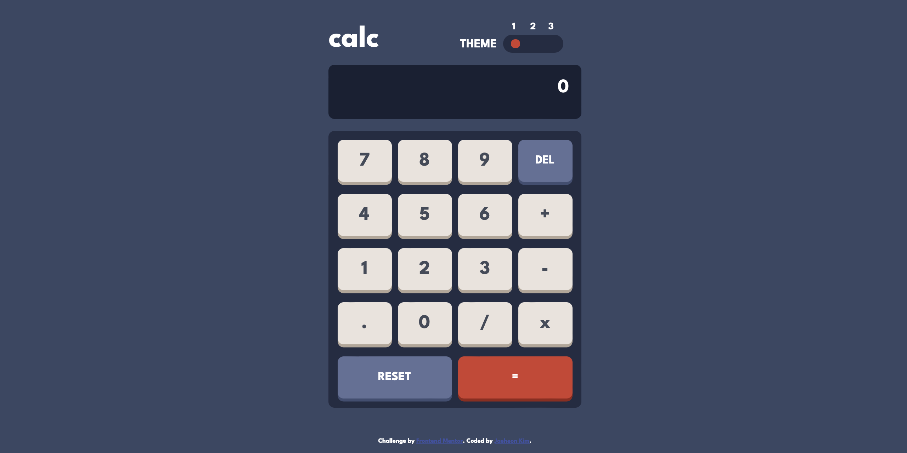
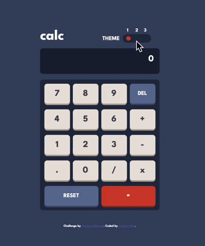
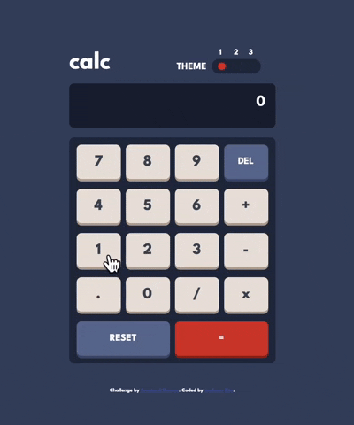

<h1 align="center">Responsive Calculator with Multiple Themes </h1>


This is a solution to the [Calculator app challenge on Frontend Mentor](https://www.frontendmentor.io/challenges/calculator-app-9lteq5N29).
## Table of contents

- [Overview](#overview)
  - [Users are able to](#users-are-able-to)
  - [Screenshot](#screenshot)
- [My process](#my-process)
  - [Built with](#built-with)
  - [What I learned](#what-i-learned)
  - [Continued development](#continued-development)
  - [Useful resources](#useful-resources)
- [Author](#author)

## Overview

### Users are able to

- See the size of the elements adjust based on their device's screen size
- Perform mathmatical operations like addition, subtraction, multiplication, and division
- Adjust the color theme based on their preference
- **Bonus**: Have their initial theme preference checked using `prefers-color-scheme` and have any additional changes saved in the browser

### Screenshot


- You can change themes by clicking theme switcher



- You can calculate consecutively by clicking any operator or equal button

## My process

### Built with

- HTML, CSS, JavaScript
- Flexbox, Grid
- Mobile-first workflow
- CSS :has pseudo-class
- CSS Custom Properties
- Windows.localstorage

### What I learned

```css
/* css */
:root:has(#dark:checked),
body.dark {
  --main-background: hsl(222, 26%, 31%);
  --toggle-background: hsl(223, 31%, 20%);
  --screen-background: hsl(224, 36%, 15%);
  /*...*/
}
```
I utilized `:has` to switch the color theme of the calculator. However, currently (Feb 2023) `:has` is not compatible with Firefox and Samsung Browser. so I made a fallback for better compatibility.
```js
// javascript, prefers-color-scheme
lightMode.addEventListener("change", (e) => {
  if (e.matches) {
    document.body.className = lightTheme.id;
    lightTheme.checked = true;
    localStorage.setItem("theme", "light");
  } else {
    document.body.className = darkTheme.id;
    darkTheme.checked = true;
    localStorage.setItem("theme", "dark");
  }
});
```
Using `window.matchMedia.matches` with `prefers-color-scheme`, Users can have their initial theme preferene checked and have any additional changes saved in the browser with `localstorage`.


### Continued development
- add a feature that copy with one click could be added next to main display

### Useful resources

- [How to build an HTML calculator app from scratch using JavaScript](https://www.freecodecamp.org/news/how-to-build-an-html-calculator-app-from-scratch-using-javascript-4454b8714b98/) - This helped me for XYZ reason. I really liked this pattern and will use it going forward.
- [JavaScript DOM Tutorial – How to Build a Calculator App in JS](https://www.freecodecamp.org/news/javascript-dom-build-a-calculator-app/)

## Author
<a href="https://github.com/jae-the-castaway" align="center"></a>
<a href="https://linkedin.com/in/jae-the-castaway" align="center"></a>
